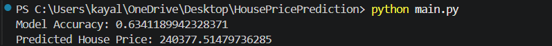

# 🚀 PRODIGY_ML_01  
## 🏡 House Price Prediction using Linear Regression  

Welcome to my Machine Learning internship project developed as part of the **Prodigy InfoTech Internship Program**. This project focuses on predicting house prices using **Linear Regression** based on real-world housing data from Kaggle.  

---

# 📌 Project Overview  

This project demonstrates the complete Machine Learning workflow including:  

✅ Data Collection  
✅ Data Preprocessing  
✅ Feature Selection  
✅ Model Training  
✅ Prediction System  
✅ Performance Evaluation  

The model predicts house prices using important housing features such as:  

- 📐 Living Area (`GrLivArea`)  
- 🛏 Bedrooms (`BedroomAbvGr`)  
- 🛁 Full Bathrooms (`FullBath`)  

---

# 🧠 Machine Learning Algorithm Used  

### 🔹 Linear Regression  

Linear Regression is a supervised Machine Learning algorithm used for predicting continuous numerical values.  

The model learns relationships between housing features and sale prices to generate accurate predictions.

---

# ⚙️ Technologies Used  

| Technology | Purpose |
|---|---|
| Python | Core Programming |
| Pandas | Data Handling |
| Scikit-learn | ML Model Training |
| NumPy | Numerical Operations |
| VS Code | Development Environment |
| Git & GitHub | Version Control |

---

# 📂 Dataset Used  

📌 Kaggle House Prices Dataset  

The dataset contains multiple housing attributes and corresponding sale prices used for training and testing the model.

---

# 📊 Model Performance  

✅ Model Accuracy (R² Score): **63.41%**  

✅ Successfully predicted house prices using custom input values.

### Example Output

```text
Model Accuracy: 0.6341189942328371
Predicted House Price: 240377.51479736285
```

---

# 💻 Installation & Execution  

## Clone Repository

```bash
git clone https://github.com/your-username/PRODIGY_ML_01.git
```

## Navigate to Folder

```bash
cd PRODIGY_ML_01
```

## Install Dependencies

```bash
pip install pandas scikit-learn
```

## Run Project

```bash
python main.py
```

---

# 📸 Project Output  

Add your screenshot file inside the repository and use:

```markdown

```

---

# 🌟 Key Learnings  

✨ Understanding of Machine Learning workflow  
✨ Hands-on experience with Linear Regression  
✨ Real-world dataset handling  
✨ Model evaluation using R² Score  
✨ GitHub project management and deployment  

---

# 🎯 Internship Task Objective  

Build a Machine Learning model capable of predicting house prices using regression techniques and evaluate its performance using suitable metrics.

---

# 👩‍💻 Author  

### KAYALVIZHI J  

Machine Learning Enthusiast | Full Stack Learner | Passionate about AI & Development  

---

# ⭐ If you found this project useful, give it a star on GitHub!
